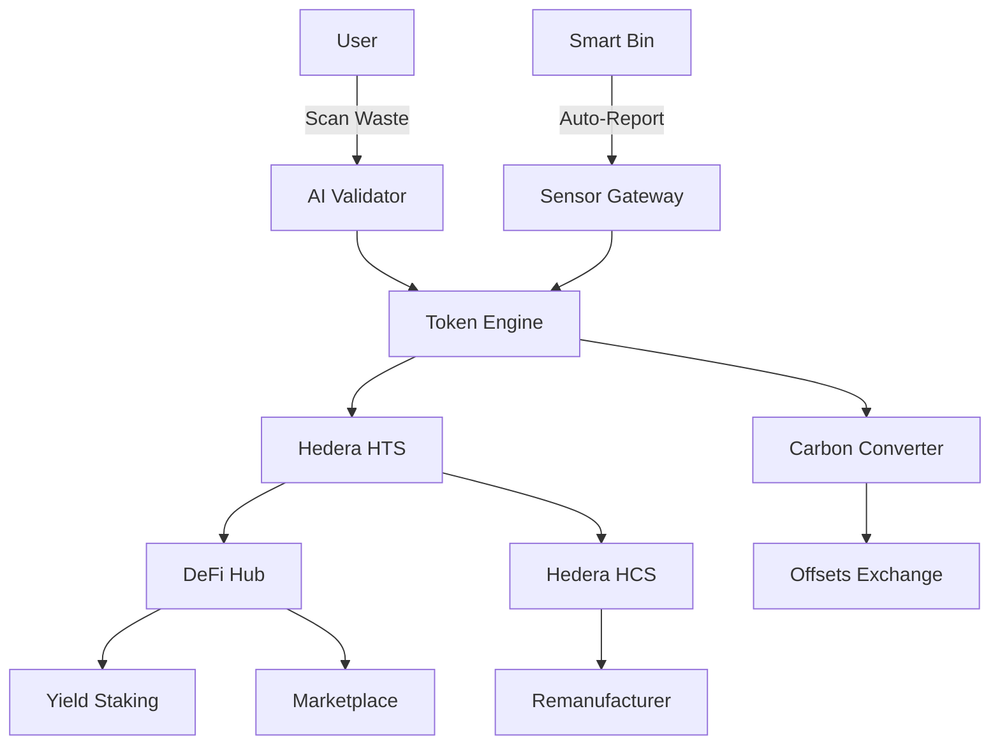
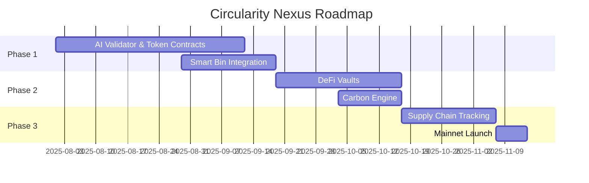

## **Circularity Nexus: Waste-to-Wealth Tokenization Platform**  
**Tagline:** "Tokenize Trash. Earn Wealth. Heal the Planet."  

---

### **Why Circularity Nexus is Groundbreaking (10/10)**  
1. **Material-Specific Tokenization:** Mint HTS tokens for 50+ waste types (e.g., #PET-1kg, #Ewaste-Unit).  
2. **AI-Powered Verification:** Computer vision validates waste quality/quantity via mobile app.  
3. **DeFi Recycling Vaults:** Stake waste tokens → earn yield from corporate ESG partners.  
4. **Carbon Credit Fusion:** Automatically convert recycled waste into tradable carbon tokens.  
5. **Reverse Supply Chain:** Track waste-to-remanufactured goods via Hedera Consensus Service.  

---

### **Robust PRD: Circularity Nexus**  
**Version:** 1.0  
**Last Updated:** July 28, 2025  

---

### **1. Core Architecture**  
**Tech Stack:**  
- **DLT:** Hedera (HTS for tokens, HCS for supply chain, Smart Contracts for DeFi)  
- **AI:** TensorFlow Lite (waste recognition), PyTorch (carbon impact modeling)  
- **IoT:** Smart bins with weight/GPS sensors  
- **Oracles:** Chainlink (recycled material prices), UNEP Recycling DB  



---

### **2. Key Components**  
#### **2.1 Tokenization System**  
| **Token Type**          | **Standard** | **Properties**                                  |  
|-------------------------|--------------|------------------------------------------------|  
| **Waste Credits**       | HTS Fungible | Granular types: #PET, #Aluminum, #Ewaste, etc. |  
| **Carbon Offsets**      | HTS Fungible | 1 token = 1kg CO2 reduced (verified)           |  
| **RecycleNFTs**         | HTS NFT      | Proof of impact: "Recycled 1 ton in 2025"      |  

#### **2.2 AI Verification Engine**  
- **Mobile Workflow:**  
  1. User scans waste pile → AI classifies material/estimates weight  
  2. Compares with smart bin sensor data (anti-fraud)  
  3. Mints tokens:  
  ```python
  def mint_tokens(waste_type, verified_kg):
      token_id = HTS_MAP[waste_type]  # e.g., "0.0.1234" for PET
      return HederaTokenMint(token_id, verified_kg * 1000)  # 1 token = 1g
  ```

#### **2.3 DeFi & Marketplace**  
- **Corporate ESG Vaults:**  
  Unilever stakes $100k USDC → rewards recyclers in high-demand materials  
- **Circular Marketplace:**  
  ```solidity
  function buyRecycledPlastic(uint kg) public {
      require(buyer.transfer(kg * token_price));
      plastic_token.transfer(buyer, kg * 1000);
      burnCarbonTokens(kg * 0.5);  // 0.5kg CO2 offset per kg plastic
  }
  ```

---

### **3. Step-by-Step Implementation**  
#### **Phase 1: Waste Tokenization (8 Weeks)**  
**Step 1: AI Validation MVP**  
1. Train waste recognition model:  
   ```python
   model = EfficientNetB3(weights='imagenet')
   model.train(recycle_dataset)  # 50k images of sorted waste
   ```  
2. **Hedera Setup:**  
   - Deploy waste token contracts:  
   ```solidity
   contract PlasticToken is HederaTokenService {
       constructor() {
           createFungibleToken("PET", "PET", 100_000_000, 6);
       }
   }
   ```

**Step 2: Smart Bin Integration**  
1. Bin sensors publish to HCS topic:  
   ```json
   {
     "bin_id": "NBO-20384",
     "weight_kg": 17.3,
     "material": "PET",
     "location": [-1.286389, 36.817223]
   }
   ```  
2. Cross-verify user submissions with sensor data  

#### **Phase 2: DeFi & Carbon (6 Weeks)**  
**Step 3: Staking & Yield**  
1. **Contract:** `RecycleVault.sol`  
   ```solidity
   function stakeWasteTokens(uint amount, address token) public {
       token.transferFrom(user, vault, amount);
       uint yield = calculateYield(token, amount); // PET = 5% APY
       usdc.transfer(user, yield);
   }
   ```  

**Step 4: Carbon Conversion**  
1. Oracle-driven carbon minting:  
   ```solidity
   function convertToCarbon(uint wasteAmount) public {
       uint co2e = Oracle.getCO2e(wasteType); // e.g., 1kg PET = 1.5kg CO2
       carbonToken.mint(user, wasteAmount * co2e);
   }
   ```  

#### **Phase 3: Circular Economy (4 Weeks)**  
**Step 5: Reverse Supply Chain**  
1. Remanufacturers buy tokens → create products  
2. Product QR codes show recycled content via HCS audit trail  

**Step 6: DAO Governance**  
1. $CIRC token holders vote on:  
   - New waste types  
   - Yield rates  
   - Partnership approvals  

---

### **4. Incentive Model**  
| **Actor**         | **Incentive**                                  |  
|-------------------|-----------------------------------------------|  
| **Individuals**   | 5-25% APY on staked waste tokens; Carbon credit sales |  
| **Corporations**  | ESG compliance; Discounts on recycled materials |  
| **Cities**        | 30% waste management cost reduction; Real-time dashboard |  

---

### **5. Risk Mitigation**  
| **Risk**                  | **Solution**                                  |  
|---------------------------|----------------------------------------------|  
| Fraudulent reporting      | AI + sensor cross-verification; DAO audits   |  
| Material price volatility | Token pegged to commodity oracles            |  
| Scalability limits        | Hedera 10k TPS; Regional sharding            |  

---

### **6. Key Metrics**  
| **Metric**                     | **Target**               |  
|--------------------------------|--------------------------|  
| Waste recognition accuracy     | >95%                     |  
| Token mint latency             | <3 seconds               |  
| Recycling participation boost  | +300% in pilot cities    |  
| Carbon issuance cost           | $0.0001/credit           |  

---

### **7. Implementation Timeline**  


---

**Next Steps:**  
1. Apply for Hedera Sustainability Grant: [$250k Fund](https://hedera.com/grants)  
2. Pilot with Lagos, Nigeria (10M population)  
3. GitHub Repo: [github.com/circularitynexus/core](https://github.com/circularitynexus/core)  

[**Start Tokenizing Waste**]  
- Testnet faucet: [app.circularitynexus.io/faucet](https://app.circularitynexus.io/faucet)  
- Run waste AI locally:  
```bash
docker run -p 5000:5000 circularitynexus/waste-ai
curl -X POST -F "image=@trash.jpg" http://localhost:5000/scan
```